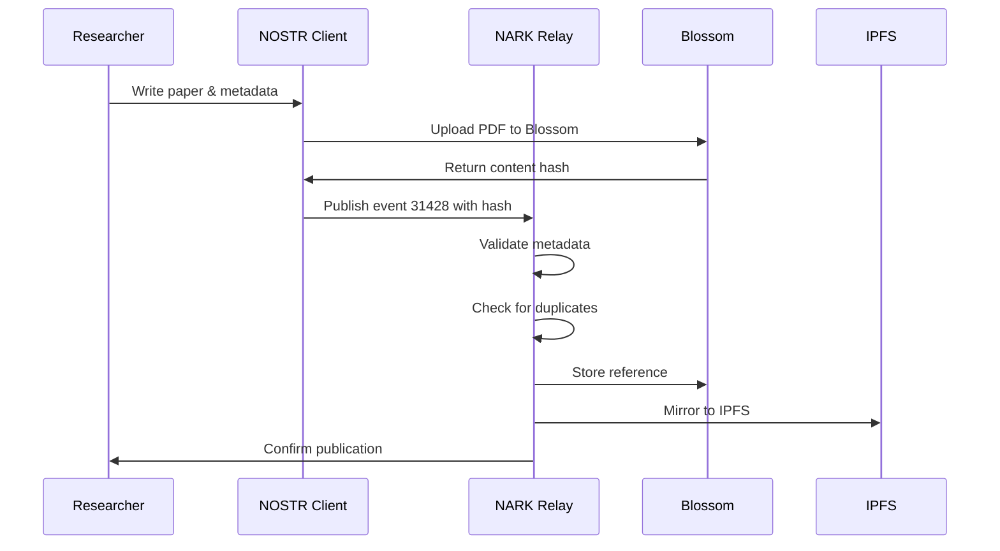
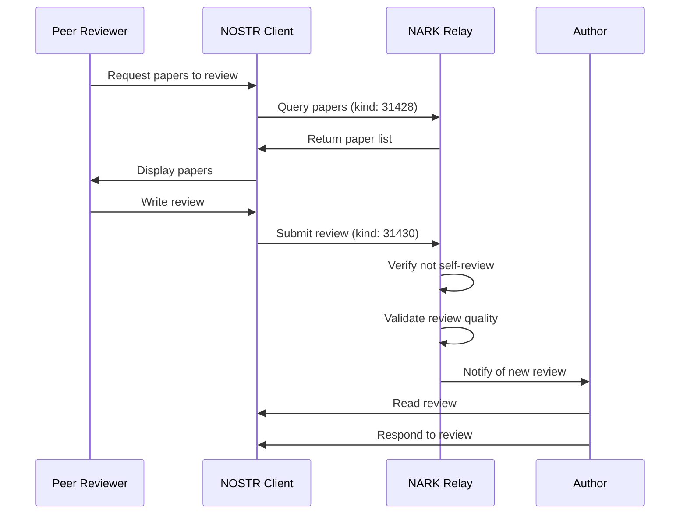
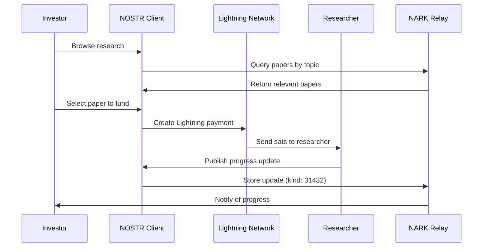

# NARK Protocol Architecture

## Overview

The NARK (NOSTR Academic Repository Kit) protocol enables decentralized academic research and publication, bypassing traditional university system limitations. This architecture allows researchers to directly publish, peer-review, and access academic content without institutional gatekeepers.

## System Architecture

```mermaid
graph TB
    subgraph "User Types"
        R[👨‍🔬 Researchers]
        P[👥 Peer Reviewers]
        S[🎓 Students]
        I[💰 Research Investors]
        C[🌍 Citizen Scientists]
        J[📰 Journalists]
    end

    subgraph "NOSTR Clients"
        NC1[Academic NOSTR Client]
        NC2[Mobile Research App]
        NC3[Web Interface]
        NC4[CLI Tools]
    end

    subgraph "NOSTR Event Types"
        E1[📄 Paper (31428)]
        E2[🔗 Citation (31429)]
        E3[📝 Review (31430)]
        E4[📊 Data (31431)]
        E5[💬 Discussion (31432)]
        E6[💵 Funding (9735)]
        E7[🏷️ Reputation (30078)]
        E8[📝 Updates (31433)]
        E9[❓ Questions (31434)]
        E10[🤝 Mentorship (31435)]
        E11[💡 Proposals (31436)]
        E12[📈 Progress (31437)]
        E13[🔬 Citizen Sci (31438)]
        E14[📰 Media (31439)]
    end

    subgraph "NARK Archival Relays"
        AR1[NARK Relay 1]
        AR2[NARK Relay 2]
        AR3[NARK Relay 3]
        
        subgraph "Relay Policies"
            POL1[Content Validation]
            POL2[Duplicate Prevention]
            POL3[Review Integrity]
            POL4[Rate Limiting]
        end
    end

    subgraph "Storage Layer"
        subgraph "Blossom Servers"
            B1[Blossom Node 1]
            B2[Blossom Node 2]
            B3[Blossom Node 3]
        end
        
        subgraph "Content Types"
            PDF[📑 PDF Papers]
            DATA[📈 Datasets]
            CODE[💻 Source Code]
            MEDIA[🎥 Media Files]
        end
    end

    subgraph "External Services"
        IPFS[IPFS Network]
        ARWEAVE[Arweave]
        DOI[DOI Registry]
        ORCID[ORCID]
    end

    %% User interactions
    R --> NC1
    P --> NC1
    S --> NC2
    I --> NC3
    C --> NC2
    J --> NC3

    %% Client to Event flow
    NC1 --> E1
    NC1 --> E2
    NC1 --> E3
    NC1 --> E4
    NC1 --> E5
    NC3 --> E6
    NC1 --> E7

    %% Events to Relays
    E1 --> AR1
    E1 --> AR2
    E1 --> AR3
    E2 --> AR1
    E2 --> AR2
    E3 --> AR1
    E3 --> AR2
    E4 --> AR1
    E4 --> AR2
    E5 --> AR1
    E5 --> AR2
    E5 --> AR3
    E6 --> AR1
    E7 --> AR1

    %% Policy enforcement
    AR1 --> POL1
    AR1 --> POL2
    AR1 --> POL3
    AR1 --> POL4

    %% Storage connections
    AR1 --> B1
    AR1 --> B2
    AR2 --> B2
    AR2 --> B3
    AR3 --> B1
    AR3 --> B3

    %% Blossom content
    B1 --> PDF
    B1 --> DATA
    B2 --> PDF
    B2 --> CODE
    B3 --> DATA
    B3 --> MEDIA

    %% External integrations
    AR1 -.-> IPFS
    AR2 -.-> ARWEAVE
    AR1 -.-> DOI
    NC1 -.-> ORCID

    style R fill:#e1f5fe
    style P fill:#e8f5e9
    style I fill:#fff3e0
    style E1 fill:#f3e5f5
    style E3 fill:#f3e5f5
    style AR1 fill:#e8eaf6
    style AR2 fill:#e8eaf6
    style AR3 fill:#e8eaf6
    style B1 fill:#fce4ec
    style B2 fill:#fce4ec
    style B3 fill:#fce4ec
```

## Component Details

### User Types

1. **Researchers** 👨‍🔬
   - Publish papers directly without institutional approval
   - Maintain full ownership of their work
   - Receive direct funding from investors

2. **Peer Reviewers** 👥
   - Provide open, transparent reviews
   - Build reputation through quality reviews
   - Cannot review their own work (enforced by protocol)

3. **Students** 🎓
   - Access all research without paywalls
   - Participate in discussions
   - Learn directly from researchers

4. **Research Investors** 💰
   - Fund research directly via Lightning payments
   - Track research progress transparently
   - Support specific research areas

5. **Citizen Scientists** 🌍
   - Contribute data and observations
   - Participate in open research
   - Access professional tools

6. **Journalists** 📰
   - Access primary sources directly
   - Verify research claims
   - Report on cutting-edge findings

### NOSTR Event Types

- **31428 - Academic Papers**: Full research papers with abstracts
- **31429 - Citations**: References between works
- **31430 - Peer Reviews**: Academic reviews with structured feedback
- **31431 - Research Data**: Datasets and supplementary materials
- **31432 - Discussions**: Academic discourse threads
- **9735 - Lightning Zaps**: Direct research funding
- **30078 - Reputation**: Academic reputation badges

### NARK Archival Relays

Specialized relays that:
- **Validate** academic content meets quality standards
- **Prevent** duplicate submissions
- **Ensure** review integrity (no self-reviews)
- **Archive** permanently (no deletions)
- **Rate limit** to prevent spam

### Blossom Storage

Distributed content-addressed storage for:
- PDF papers and preprints
- Large datasets
- Source code repositories
- Media files (videos, images)
- Supplementary materials

## Data Flow Examples

### Publishing a Paper



### Peer Review Process



### Research Funding



## Benefits Over Traditional System

1. **No Gatekeeping**: Researchers publish directly without institutional approval
2. **Open Access**: All content freely available, no paywalls
3. **Direct Funding**: Investors fund researchers directly via Lightning
4. **Transparent Reviews**: All peer reviews are public and verifiable
5. **Permanent Archive**: Content cannot be censored or deleted
6. **Global Collaboration**: No geographic or institutional barriers
7. **Reputation-Based**: Merit determined by community, not titles
8. **Fast Publication**: No multi-month review delays

## Security & Trust

- **Cryptographic Signatures**: All content signed by authors
- **Content Addressing**: Blossom ensures content integrity
- **Decentralized Storage**: No single point of failure
- **Review Integrity**: Protocol prevents conflicts of interest
- **Rate Limiting**: Prevents spam and abuse
- **Reputation System**: Bad actors naturally filtered out

## Future Enhancements

- Integration with traditional DOI system
- Automated plagiarism detection
- AI-assisted peer review
- Decentralized compute for research
- Privacy-preserving analytics
- Cross-relay synchronization
- Academic NFTs for achievements