# NARK Protocol Implementation Roadmap

## Overview

Based on user perspective analysis, this roadmap prioritizes features that deliver maximum value to each user type while building on the core archival relay infrastructure.

## Phase 1: Core Protocol (Current) ✅

**Status**: Implemented in this repository

### Completed Features
- ✅ Academic event types (31428-31432)
- ✅ Content validation policies
- ✅ Duplicate prevention
- ✅ Review integrity checks
- ✅ Rate limiting
- ✅ PostgreSQL storage
- ✅ Docker deployment

### Users Served
- Basic researcher publishing
- Simple peer review
- Permanent archival

## Phase 2: Enhanced Event Types (Q1 2025)

### New Event Types to Implement

```typescript
// Paper Updates (31433)
{
  "kind": 31433,
  "tags": [
    ["e", "original-paper-event-id"],
    ["version", "2.0"],
    ["changes", "Added new experimental data, revised conclusions"],
    ["diff-url", "blossom://hash-of-diff-file"]
  ]
}

// Academic Questions (31434)
{
  "kind": 31434,
  "tags": [
    ["e", "paper-or-discussion-id"],
    ["question-type", "methodology|clarification|data|theory"],
    ["field", "computer-science.distributed-systems"]
  ]
}

// Mentorship Connections (31435)
{
  "kind": 31435,
  "tags": [
    ["mentor-type", "offer|request"],
    ["fields", "machine-learning", "cryptography"],
    ["experience", "phd|postdoc|professor|industry"],
    ["availability", "2-hours-per-week"]
  ]
}

// Funding Proposals (31436)
{
  "kind": 31436,
  "tags": [
    ["funding-amount", "50000"],
    ["currency", "USD|BTC|sats"],
    ["duration", "12-months"],
    ["milestones", "4"],
    ["abstract", "brief-description"],
    ["budget-url", "blossom://budget-hash"]
  ]
}

// Progress Reports (31437)
{
  "kind": 31437,
  "tags": [
    ["e", "funding-proposal-id"],
    ["milestone", "2-of-4"],
    ["completion", "75%"],
    ["report-url", "blossom://report-hash"],
    ["next-milestone-date", "2025-06-01"]
  ]
}

// Citizen Science Projects (31438)
{
  "kind": 31438,
  "tags": [
    ["project-type", "data-collection|analysis|observation"],
    ["location", "global|specific-region"],
    ["requirements", "smartphone|training|equipment"],
    ["data-format", "json|csv|images"],
    ["contribution-guide", "blossom://guide-hash"]
  ]
}

// Media Summaries (31439)
{
  "kind": 31439,
  "tags": [
    ["e", "paper-event-id"],
    ["summary-type", "press-release|blog|video"],
    ["language", "en|es|zh|etc"],
    ["embargo-until", "timestamp"],
    ["contact", "author-email"]
  ]
}
```

### Implementation Tasks
1. Update relay to accept new event kinds
2. Add validation rules for each type
3. Create TypeScript/Go interfaces
4. Update documentation
5. Build example clients

## Phase 3: Reputation & Metrics System (Q2 2025)

### Reputation Components

```mermaid
graph TD
    subgraph "Reputation Metrics"
        RP[Research Points]
        RV[Review Quality]
        CT[Citation Impact]
        FD[Funding Success]
        CS[Citizen Science]
        MT[Mentorship]
    end
    
    subgraph "Calculation"
        RP --> SCORE[Composite Score]
        RV --> SCORE
        CT --> SCORE
        FD --> SCORE
        CS --> SCORE
        MT --> SCORE
        
        SCORE --> BADGE[Award Badges]
        SCORE --> RANK[Rankings]
    end
    
    subgraph "Badges"
        B1[🥇 Top Researcher]
        B2[⭐ Quality Reviewer]
        B3[🎯 High Impact]
        B4[💡 Innovation]
        B5[🤝 Great Mentor]
        B6[🌍 Citizen Champion]
    end
```



### Features
- Automated reputation calculation
- Badge NFTs on NOSTR
- Leaderboards by field
- Reputation decay over time
- Sybil attack prevention

## Phase 4: Advanced Discovery (Q3 2025)

### Search & Recommendation Engine


### Implementation
- Elasticsearch integration
- ML-based recommendations
- Real-time notifications via NOSTR
- GraphQL API for complex queries

## Phase 5: Mobile & Field Tools (Q4 2025)

### Mobile Applications


### Features
- React Native apps
- Offline-first architecture
- Camera integration
- Location services
- Push notifications

## Phase 6: Integrations (Q1 2026)

### Bridge Traditional Academia


### Features
- ORCID authentication
- DOI minting for papers
- ArXiv cross-posting
- Citation export tools
- University repository sync

## Phase 7: AI & Automation (Q2 2026)

### AI-Powered Features


### Implementation
- Local LLM integration
- Federated learning for privacy
- Automated quality checks
- Multi-language support

## Success Metrics

### Year 1 Goals
- 1,000 active researchers
- 10,000 papers published
- 50,000 peer reviews
- $100,000 in direct funding

### Year 2 Goals
- 10,000 active researchers
- 100,000 papers
- 500,000 reviews
- $1M in direct funding

### Long-term Vision
- Replace traditional journals
- Enable global research collaboration
- Eliminate research paywalls
- Democratize scientific knowledge

## Development Priorities

1. **User Experience**: Simple, intuitive interfaces
2. **Performance**: Fast search and retrieval
3. **Reliability**: 99.9% uptime for archival
4. **Security**: Cryptographic guarantees
5. **Accessibility**: Support all users
6. **Decentralization**: No single point of failure

## Call to Action

Join us in building the future of academic publishing:

- **Developers**: Contribute code and tools
- **Researchers**: Publish your next paper
- **Funders**: Support the infrastructure
- **Everyone**: Spread the word

The revolution in academic publishing starts now! 🚀