# NARK Protocol Overview

## Core Protocol Flow

```mermaid
graph LR
    subgraph "Academic Community"
        R[👨‍🔬 Researcher]
        PR[👥 Peer Reviewer]
        F[💰 Funder]
        S[🎓 Student]
    end

    subgraph "NOSTR Layer"
        NC[NOSTR Client]
        NR[NARK Relay]
        
        subgraph "Event Types"
            E1[📄 Paper<br/>31428]
            E2[📝 Review<br/>31430]
            E3[💵 Funding<br/>9735]
        end
    end

    subgraph "Storage"
        B[🌸 Blossom<br/>Storage]
        DB[(PostgreSQL)]
    end

    R -->|1. Publish| NC
    NC -->|2. Create Event| E1
    E1 -->|3. Submit| NR
    NR -->|4. Validate| NR
    NR -->|5. Store Hash| DB
    NR -->|6. Store File| B
    
    PR -->|7. Review| E2
    E2 -->|8. Link to Paper| NR
    
    F -->|9. Fund via Lightning| E3
    E3 -->|10. Zap Paper| R
    
    S -->|Open Access| B
    
    style R fill:#e3f2fd
    style PR fill:#e8f5e9
    style F fill:#fff3e0
    style S fill:#f3e5f5
    style NR fill:#e8eaf6
    style B fill:#fce4ec
```

## How It Works

1. **Researchers** publish papers directly to NOSTR without institutional gatekeepers
2. **NARK Relays** validate and permanently archive academic content
3. **Blossom** stores large files (PDFs, datasets) in a distributed manner
4. **Peer Reviewers** provide transparent, public reviews
5. **Funders** support research directly via Lightning payments
6. **Students** access all content freely without paywalls

## Key Advantages

- ✅ **No Censorship**: Decentralized architecture prevents content suppression
- ✅ **No Paywalls**: All research freely accessible to everyone
- ✅ **Direct Funding**: Researchers receive support without institutional overhead
- ✅ **Fast Publication**: No artificial delays from traditional journals
- ✅ **Transparent Reviews**: All peer reviews are public and verifiable
- ✅ **Permanent Archive**: Research preserved forever, cannot be deleted