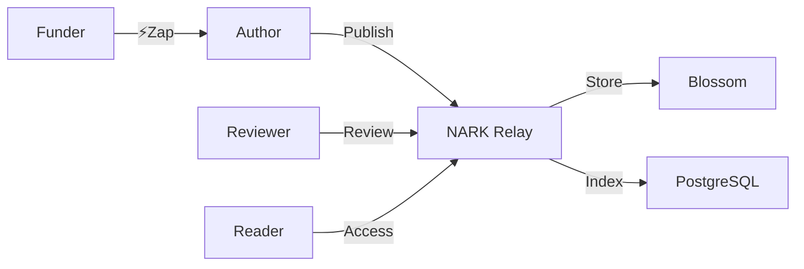

# NARK Protocol Quick Reference

## Event Types (NIP-Compliant)

### Regular Events (Immutable)
| Kind | Type | Description | Required Tags |
|------|------|-------------|---------------|
| 8429 | 🔗 Citation | References between works | `e` (paper ref), `context` |
| 8430 | 📝 Review | Peer reviews | `e` (paper ref), `content`, review tags |
| 8432 | 💬 Discussion | Academic discourse | `e` (ref), content (50+ chars) |
| 8434 | ❓ Question | Academic questions | `e`/`a` (ref), `question-type` |

### Addressable Events (Replaceable)
| Kind | Type | Description | Required Tags |
|------|------|-------------|---------------|
| 31428 | 📄 Paper | Academic papers | `d`, `title`, `abstract`, `subject`, `author` |
| 31431 | 📊 Data | Research datasets | `d`, `e` (paper ref), `data-type`, `description` |
| 31433 | 📝 Update | Paper updates | `d`, `e` (original), `version`, `changes` |
| 31435 | 🤝 Mentorship | Mentorship offers | `d`, `mentor-type`, `fields` |
| 31436 | 💡 Proposal | Funding proposals | `d`, `funding-amount`, `duration`, `abstract` |
| 31437 | 📈 Progress | Progress reports | `d`, `e`/`a` (proposal), `milestone`, `completion` |
| 31438 | 🔬 Citizen Project | Citizen science | `d`, `project-type`, `requirements`, `data-format` |
| 31439 | 📰 Media | Media summaries | `d`, `e`/`a` (paper), `summary-type`, `language` |

### Standard NOSTR Events Used
| Kind | Type | Description | Usage |
|------|------|-------------|-------|
| 7 | 👍 Reaction | Reactions (NIP-25) | Paper feedback |
| 30023 | 📜 Long-form | Long-form content (NIP-23) | Alternative for papers |
| 9735 | ⚡ Zap | Lightning payment (NIP-57) | Research funding |
| 30009 | 🏅 Badge Def | Badge definition (NIP-58) | Academic achievements |
| 8 | 🎖️ Badge Award | Badge award (NIP-58) | Reputation system |

## Architecture at a Glance



## Policy Summary

- **Rate Limits**: 5 papers/day, 10 reviews/day, 50 discussions/hour
- **No Deletions**: Permanent archival (no event deletion allowed)
- **No Self-Review**: Authors cannot review their own work
- **Duplicate Check**: Content-hash based deduplication
- **Open Access**: All content freely available

## Quick Start Commands

```bash
# Run with Docker
docker-compose up -d

# Check health
curl http://localhost:3334/health

# View policies
curl http://localhost:3334/policies

# Run tests
make test
```