# NARK Protocol Quick Reference

## Event Types

| Kind | Type | Description | Required Tags |
|------|------|-------------|---------------|
| 31428 | 📄 Paper | Academic papers | `title`, `abstract`, `subject`, `author` |
| 31429 | 🔗 Citation | References between works | `e` (paper ref), `context` |
| 31430 | 📝 Review | Peer reviews | `e` (paper ref), `content`, review tags |
| 31431 | 📊 Data | Research datasets | `e` (paper ref), `data-type`, `description` |
| 31432 | 💬 Discussion | Academic discourse | `e` (ref), content (50+ chars) |

## Architecture at a Glance

```mermaid
graph LR
    A[Author] -->|Publish| B[NARK Relay]
    B -->|Store| C[Blossom]
    B -->|Index| D[PostgreSQL]
    E[Reviewer] -->|Review| B
    F[Reader] -->|Access| B
    G[Funder] -->|⚡Zap| A
```



## Policy Summary

- **Rate Limits**: 5 papers/day, 10 reviews/day, 50 discussions/hour
- **No Deletions**: Permanent archival (no event deletion allowed)
- **No Self-Review**: Authors cannot review their own work
- **Duplicate Check**: Content-hash based deduplication
- **Open Access**: All content freely available

## Quick Start Commands

```bash
# Run with Docker
docker-compose up -d

# Check health
curl http://localhost:3334/health

# View policies
curl http://localhost:3334/policies

# Run tests
make test
```