# NARK Protocol Use Cases

## Real-World Scenarios

### 1. Independent Researcher Publishing

### 2. Citizen Science Collaboration

```mermaid
sequenceDiagram
    participant CS as Citizen Scientist
    participant R as Professional Researcher
    participant N as NARK Network
    participant D as Data Storage (Blossom)
    
    CS->>N: Upload observation data (kind: 31431)
    N->>D: Store raw data files
    R->>N: Query citizen science data
    N->>R: Return matching datasets
    R->>N: Publish analysis (kind: 31428)
    N->>CS: Notify of paper using their data
    CS->>R: ⚡ Zap paper (Lightning tip)
    R->>CS: Acknowledge contribution
```

### 3. Cross-Institutional Collaboration

### 4. Research Funding Without Bureaucracy

### 5. Solving the Replication Crisis

## Key Benefits Illustrated

### Breaking Down Barriers

| Traditional Academia | NARK Protocol |
|---------------------|---------------|
| 🚫 Institutional affiliation required | ✅ Anyone can publish |
| 🚫 Months of review delays | ✅ Immediate publication |
| 🚫 Paywalled access | ✅ Free for everyone |
| 🚫 Anonymous reviewers | ✅ Transparent review process |
| 🚫 Limited funding sources | ✅ Global micro-funding |
| 🚫 Data often unavailable | ✅ All data permanently stored |
| 🚫 Censorship possible | ✅ Uncensorable archive |

### Use Case: COVID-19 Research

### Economic Model

```mermaid
graph TD
    subgraph "Value Flow"
        READERS[Readers/Students] -->|⚡ Zaps| RESEARCHERS[Researchers]
        FUNDERS[Funders] -->|⚡ Large Zaps| RESEARCHERS
        RESEARCHERS -->|Knowledge| READERS
        RESEARCHERS -->|Results| FUNDERS
        REVIEWERS[Peer Reviewers] -->|Quality Control| SYSTEM[NARK System]
        SYSTEM -->|⚡ Review Rewards| REVIEWERS
    end
    
    subgraph "No Middlemen"
        X1[❌ Publishers]
        X2[❌ Journal Fees]
        X3[❌ Institutional Cuts]
        X4[❌ Access Fees]
    end
```

## Getting Started

Ready to join the decentralized academic revolution?

1. **As a Researcher**: Publish your next paper on NARK
2. **As a Reviewer**: Provide open, constructive peer review
3. **As a Funder**: Support research directly with Lightning
4. **As a Student**: Access all human knowledge freely
5. **As a Developer**: Run a NARK relay or build tools

The future of academic research is open, transparent, and decentralized. Join us in building it!