# NARK Protocol: User Perspective Analysis

## 1. Researcher Perspective 👨‍🔬

### Current Pain Points
- Long publication delays (6-12 months)
- High journal fees ($1,500-$5,000)
- Loss of copyright to publishers
- Limited reach behind paywalls
- Difficulty securing funding

### NARK Solution

### Required Features
- **Version Control**: Link updated papers to originals
- **Collaboration Tools**: Co-author management
- **Metrics Dashboard**: Track citations, reviews, zaps
- **Export Options**: Generate CV, ORCID integration

### Proposed Enhancement
Add event type 31433 for "Paper Updates" that references the original paper and describes changes.

## 2. Peer Reviewer Perspective 👥

### Current Pain Points
- No recognition for review work
- Anonymous reviews hide bias
- No compensation for time
- Limited feedback on review quality

### NARK Solution

### Required Features
- **Review Templates**: Structured review formats
- **Expertise Matching**: AI-powered paper recommendations
- **Reputation System**: Track review quality scores
- **Review Rewards**: Automatic zap distribution for quality reviews

### Proposed Enhancement
Add reputation event (30078) subtypes for different review qualities: "thorough-reviewer", "subject-expert", "constructive-critic".

## 3. Student/Early Career Researcher Perspective 🎓

### Current Pain Points
- Cannot access papers (paywall)
- No direct interaction with authors
- Difficult to get feedback
- Hard to build reputation

### NARK Solution

### Required Features
- **Learning Paths**: Curated paper collections by topic
- **Q&A System**: Direct questions to authors
- **Mentorship Matching**: Connect with senior researchers
- **Student Badges**: Recognition for contributions

### Proposed Enhancement
Add event type 31434 for "Academic Questions" and 31435 for "Mentorship Offers".

## 4. Research Funder/Investor Perspective 💰

### Current Pain Points
- Opaque funding allocation
- No direct researcher access
- Institutional overhead (40-60%)
- Difficulty tracking impact

### NARK Solution

### Required Features
- **Impact Metrics**: Real-time research impact tracking
- **Funding Contracts**: Milestone-based payments
- **Portfolio Dashboard**: Track all funded research
- **Due Diligence Tools**: Researcher verification

### Proposed Enhancement
Add event type 31436 for "Funding Proposals" and 31437 for "Progress Reports".

## 5. Citizen Scientist Perspective 🌍

### Current Pain Points
- No platform for contributions
- Work goes unrecognized
- Cannot access research
- No collaboration tools

### NARK Solution

### Required Features
- **Data Templates**: Standardized data collection forms
- **Mobile Apps**: Field data collection tools
- **Attribution System**: Automatic contributor credits
- **Project Matching**: Find projects needing data

### Proposed Enhancement
Add event type 31438 for "Citizen Science Projects" with structured data requirements.

## 6. Science Journalist Perspective 📰

### Current Pain Points
- Paywalled sources
- Cannot verify claims
- Difficulty finding experts
- PR spin vs. actual research

### NARK Solution

### Required Features
- **Press Kits**: Auto-generated summaries for media
- **Expert Directory**: Find researchers by expertise
- **Embargo System**: Time-delayed public release
- **Fact-Check Tools**: Verify claims against data

### Proposed Enhancement
Add event type 31439 for "Media Summaries" that link to papers with plain-language explanations.

## Updated Architecture with User-Centric Features

```mermaid
graph TB
    subgraph "Enhanced Event Types"
        E1[📄 Papers - 31428]
        E2[🔗 Citations - 31429]
        E3[📝 Reviews - 31430]
        E4[📊 Data - 31431]
        E5[💬 Discussions - 31432]
        E6[📝 Paper Updates - 31433]
        E7[❓ Questions - 31434]
        E8[🤝 Mentorship - 31435]
        E9[💡 Proposals - 31436]
        E10[📈 Progress - 31437]
        E11[🔬 Citizen Projects - 31438]
        E12[📰 Media Summary - 31439]
    end
    
    subgraph "Supporting Infrastructure"
        REP[Reputation System]
        METRICS[Impact Metrics]
        SEARCH[Advanced Search]
        NOTIFY[Notification System]
        EXPORT[Export Tools]
        MOBILE[Mobile Apps]
        API[Developer API]
    end
    
    subgraph "User Interfaces"
        UI1[Researcher Dashboard]
        UI2[Reviewer Portal]
        UI3[Student Hub]
        UI4[Funder Analytics]
        UI5[Citizen Science App]
        UI6[Media Center]
    end
    
    E1 --> REP
    E3 --> REP
    E1 --> METRICS
    E2 --> METRICS
    
    UI1 --> API
    UI2 --> API
    UI3 --> API
    UI4 --> API
    UI5 --> MOBILE
    UI6 --> API
```

## Key Improvements Needed

1. **Version Control**: Papers need versioning with clear change tracking
2. **Reputation System**: Multi-faceted reputation for different contributions
3. **Search & Discovery**: Advanced filtering by field, quality, recency
4. **Notification System**: Follow researchers, topics, and papers
5. **Mobile Support**: Field work and on-the-go access
6. **Export Tools**: Integration with existing academic systems
7. **Multilingual Support**: Global accessibility
8. **Accessibility**: Screen reader support, high contrast modes

## Implementation Priority

1. **Phase 1**: Core protocol (current implementation)
2. **Phase 2**: Reputation system and metrics
3. **Phase 3**: Advanced search and notifications
4. **Phase 4**: Mobile apps and field tools
5. **Phase 5**: Integration bridges (ORCID, DOI, etc.)